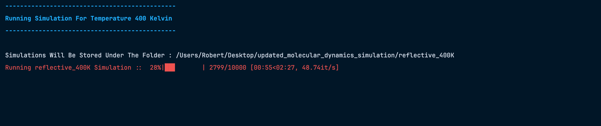
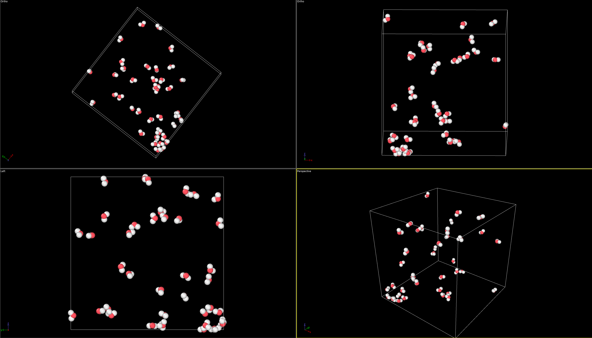

# Molecular Dynamics Simulation of Water

This project is a simple molecular dynamics simulation of water molecules, built as an exercise to learn the fundamental concepts of MD simulations. Below an example of hydrogen bonding that we got from the simulation at 200 kelvin.


## Overview

The simulation models a system of water molecules using the TIP3P/F force field. It computes the trajectory of each atom over time by numerically solving Newton's equations of motion.

The key components implemented are:
*   **Force Field:** Interactions are modeled using Lennard-Jones potentials, bond stretching, angle bending, and electrostatic forces.
*   **Integration:** The [Verlet integration](https://en.wikipedia.org/wiki/Verlet_integration) algorithm is used to update particle positions and velocities.
*   **Thermostat:** A velocity scaling thermostat is used to maintain the system at a desired temperature.
*   **Boundary Conditions:** The simulation supports both periodic and reflective boundary conditions.

## Configuration

All simulation parameters, such as the number of molecules, temperature, and force field constants, can be adjusted in the `configurations/simulation_configurations.yml` file. The file is commented to explain the role of each parameter.

## Getting Started

### Prerequisites

*   Python 3.12+
*   [Poetry](https://python-poetry.org/)

### Installation

1.  Clone the repository:
    ```bash
    git clone https://github.com/your-username/molecular-dynamics.git
    ```
2.  Navigate to the project directory:
    ```bash
    cd molecular-dynamics
    ```
3.  Install the dependencies using Poetry:
    ```bash
    poetry install
    ```

### Running the Simulation

Before running, make sure to update the `simulation_directory` path in the `configurations/simulation_configurations.yml` file to your desired output location.
```bash
##############################################################################################
#                                     Simulation Setup                                       #
##############################################################################################

# The absolute path to the directory where simulation output files (.dump) will be saved.
simulation_directory: "path/to/simulation/folder"

```


To run the simulation, execute the `simulator.py` script:

```bash
# Activate the virtual environment
poetry env activate

# It should give you something like this 
source .venv/bin/activate

# Then run the simulation
python simulator/simulator.py
```

The run of the script should look something like this ( for instance for a temperature of 400K):



The script will read the configuration from the YAML file and start the simulation.

## Visualizing the Output

The simulation generates a series of `.dump` files, one for each time step, in the output directory specified in your configuration file.


```bash
# Output should be in a folder and look something like this.
reflective_400K
├── 0.dump
├── 1.dump
├── 2.dump
├── 3.dump
├── ...
├── 9997.dump
├── 9998.dump
└── 9999.dump
```


To visualize the simulation, you can use [OVITO](https://www.ovito.org/), a scientific visualization and analysis software for atomistic and particle simulation data.

1.  Download and install OVITO from their website.
2.  Open OVITO and use the "Load File" option.
3.  Navigate to your simulation output directory and select all the `.dump` files to see the animation.

Here is an example of what the simulation should look like in OVITO:



## Acknowledgements

A special thanks to Russell from the [Polymertheory](https://www.youtube.com/@PolymerTheory) YouTube channel. His video, "[Molecular Dynamics in 100 Lines of Python](https://www.youtube.com/watch?v=ChQbBqndwIA)", was an invaluable resource that greatly helped in understanding the inner workings of molecular dynamics.
